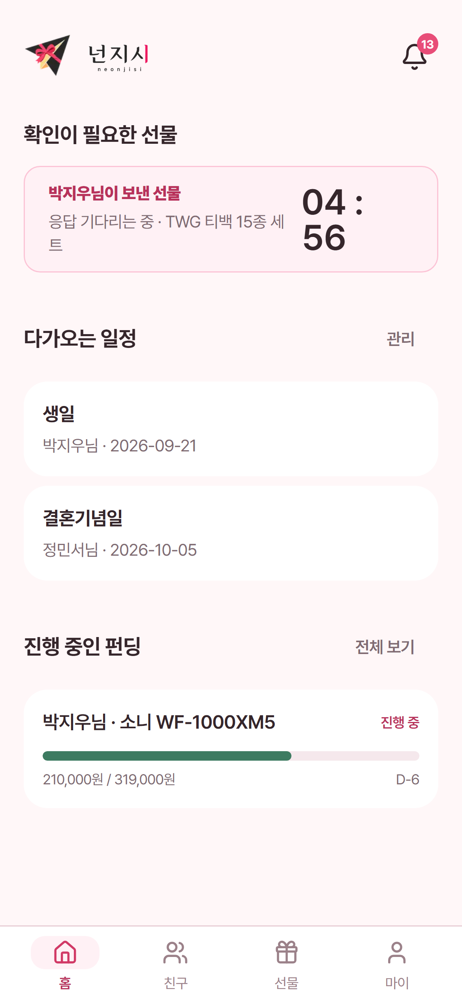
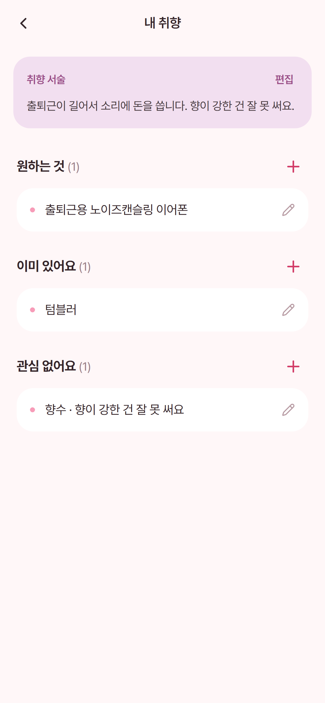
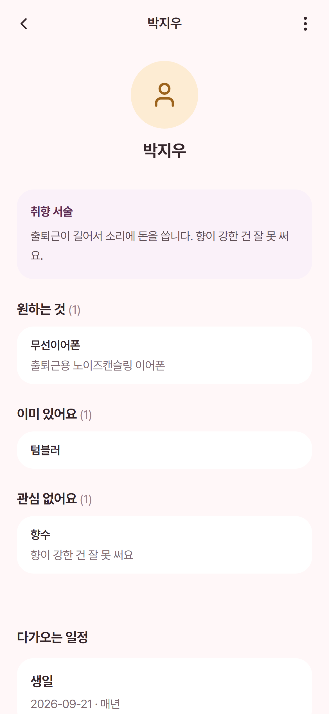
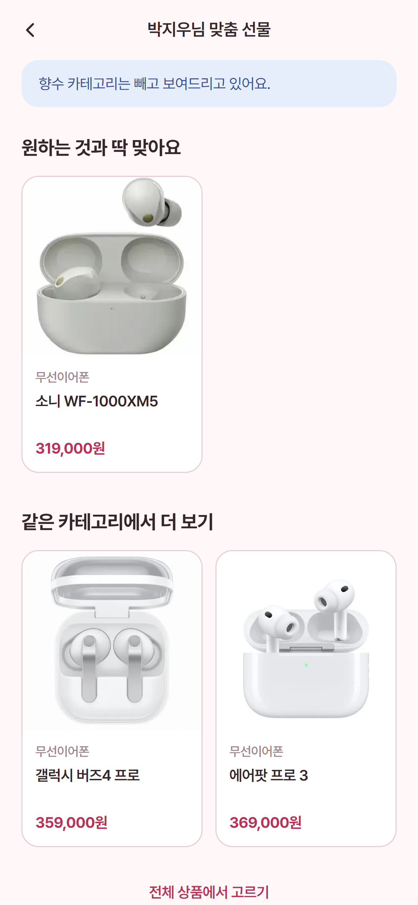
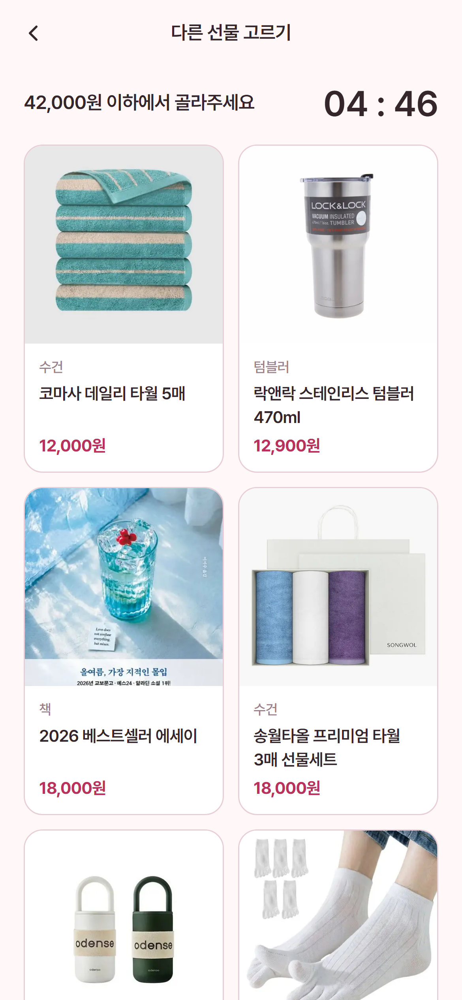
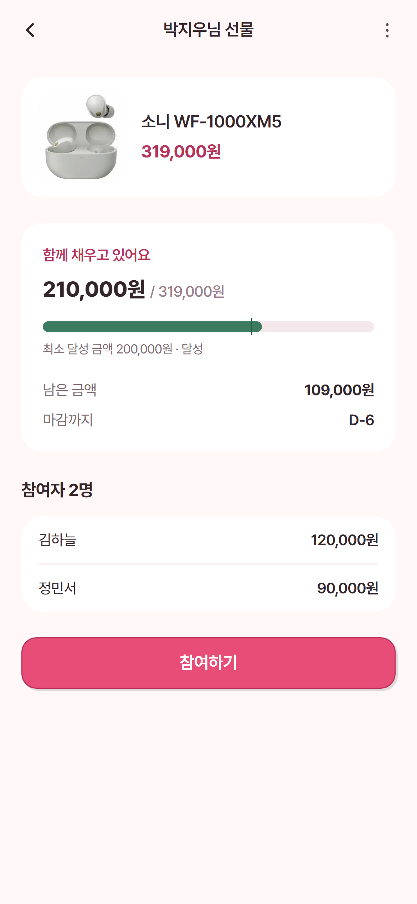

<p align="center">
  
</p>

# 넌지시 (neonjisi)

> 말하기 어려웠던 취향을 넌지시 전하고, 정말 원하는 선물을 주고받는 서비스.

**넌지시**는 원하는 것뿐 아니라 **이미 있는 것과 관심 없는 것**까지 기록해 친구에게 공유하는 선물 서비스입니다. 친구의 취향을 살펴 선물을 제안하고, 받는 사람이 승인하거나 다른 상품을 선택하면 결제가 진행됩니다. 고가의 선물은 공동 펀딩으로 함께 준비할 수 있습니다.

모바일 중심 웹 서비스 · 4인 팀 프로젝트 · v0.1.0

## 1. 프로젝트 소개

### 기획 배경

선물을 고를 때 상대의 취향을 몰라 고민하거나, 이미 가지고 있는 물건을 선물하는 일이 있습니다. 받는 사람도 원하는 것을 직접 말하기 어려워 필요하지 않은 선물을 받곤 합니다.

넌지시는 받는 사람이 직접 남긴 취향을 선물 선택의 기준으로 삼습니다. 단순한 위시리스트에서 나아가, 피하고 싶은 선물까지 전달하고 최종 선택에도 참여할 수 있도록 설계했습니다.

### 주요 사용자와 제공 가치

| 사용자 | 겪는 문제 | 넌지시가 제공하는 경험 |
| --- | --- | --- |
| 선물을 받는 사람 | 원하는 것을 말하기 어렵고, 필요 없는 선물이 쌓임 | 취향 기록·공유, 선물 승인 또는 대안 선택 |
| 선물을 보내는 사람 | 상대의 취향과 보유 물건을 알기 어려움 | 친구 취향 확인, 관심 없는 종류를 제외한 상품 탐색 |
| 함께 선물하는 친구들 | 고가 선물의 비용을 나누고 진행 상황을 확인하기 번거로움 | 펀딩 개설·참여, 모금 현황과 성사·환불 결과 확인 |

### 핵심 사용자 흐름

1. **취향 기록** — Google 로그인 후 이미 있는 것·관심 없는 것을 등록하고, 원하는 것과 취향 설명을 추가합니다.
2. **친구 연결** — 초대 링크를 공유하고, 상대가 로그인 후 수락하면 서로의 상세 취향을 볼 수 있습니다.
3. **선물 제안** — 친구의 취향을 참고해 상품을 고르고, 결제 상한에 동의한 뒤 선물을 요청합니다.
4. **수령자 선택** — 받는 사람이 승인하거나 최초 요청 금액 이하의 다른 상품을 선택하고 배송지를 입력합니다.
5. **선물 확정** — 수령자 확정 후 결제를 진행하고, 결과와 내역을 확인합니다. 여러 명이 준비할 때는 공동 펀딩을 이용합니다.

## 2. 주요 화면

저장소에 보관된 실제 구동 캡처입니다. 모바일 화면 기준이며, 결제·펀딩 시연에는 mock 결제를 사용합니다.

| 홈 | 내 취향 | 친구 취향 |
| :---: | :---: | :---: |
|  |  |  |

| 친구 맞춤 상품 | 선물 대안 선택 | 공동 펀딩 |
| :---: | :---: | :---: |
|  |  |  |

전체 화면은 [스크린샷 목록](pt-shots/촬영목록.md)과 [화면 요약 보드](pt-shots/_요약보드.png)에서 확인할 수 있습니다.

## 3. 구현 기능

현재 저장소의 코드와 마일스톤 문서를 기준으로 정리했습니다. 결제 기능의 실연동 범위와 남은 작업은 **8. 미구현 사항 및 향후 개선**에 별도로 설명합니다.

| 영역 | 주요 구현 내용 |
| --- | --- |
| 인증·가입 | Supabase 기반 Google 로그인, 표시 이름 등록, 세션 확인, 온보딩 단계 안내 |
| 맞춤 취향 프로필 (M1) | 대분류 선택, 원하는 것·이미 있는 것·관심 없는 것 등록/수정/삭제, 상세 설명·자유 취향 서술, 중복·모순 입력 검증 |
| 친구·취향 공유 (M2) | 초대 링크 발급·복사·공유·중지, 비로그인 미리보기, 링크 수락으로 친구 연결, 친구 목록·취향 열람, 친구 해제 |
| 상품 탐색 (M3) | 상품 검색·카테고리 필터·상세, 친구 맞춤 목록, 관심 없는 대분류 제외, 원하는 상품·보유 카테고리 안내, 카탈로그 상품을 위시리스트에 추가 |
| 선물 요청 (M3) | 수령자 선택, 요청 금액 이하 결제 동의, 요청 생성·취소·만료, 수령자 승인·대안 선택, 배송지 입력, 결과·보낸/받은 내역 |
| 결제·실패 복구 (M3) | mock 결제수단 등록, 빌링키 암호화, 수령자 확정 후 결제, 실패 안내, 결제수단 변경·재시도, 재시도 기간·횟수 제한 |
| 공동 펀딩 (M4) | 나에게/친구에게 펀딩 개설, 목표·최소 달성선·마감 설정, 금액 예약 후 참여 결제, 초과 모금 방지, 조기 성사, 차액 결제, 미달·취소 시 환불, 내역 |
| 홈·일정·알림 | 승인 대기·진행 중 펀딩·다가오는 일정 통합, 생일·기념일·기타 일정 관리, 서비스 내 알림과 읽음 처리, 마이 페이지 |

### 서비스 정책

- **취향은 본인이 작성합니다.** 친구의 취향을 대신 등록하지 않습니다.
- **상세 취향은 활성 친구에게 공개합니다.** 비로그인 초대 미리보기는 이름·대표 태그 등 제한된 정보만 보여줍니다. 친구 해제 후 상세 취향 접근은 차단합니다.
- **초대 링크 수락 후 발급자의 추가 승인 없이 친구가 됩니다.** 발급 화면에 이를 고지하고, 링크 만료·중지 기능을 제공합니다.
- **일반 선물은 요청할 때 결제하지 않습니다.** 수령자가 확정한 뒤 결제하며, 대안 상품은 최초 요청 금액을 넘을 수 없습니다.
- **이미 있는 것과 관심 없는 것을 다르게 처리합니다.** 보유한 종류는 안내하고, 관심 없는 종류는 친구 맞춤 상품 목록에서 제외합니다.
- **펀딩은 참여할 때 결제합니다.** 최소 달성선 미만이면 전액 환불하고, 달성선 이상이지만 목표에 못 미치면 주최자가 차액을 부담합니다. 목표 초과 참여는 허용하지 않습니다.
- **자신을 위한 펀딩은 최소 달성선이 목표 금액과 같습니다.** 주최자와 수령자가 같은 경우 별도의 차액 부담 없이 전액 모금되어야 성사됩니다.
- **참여자별 이름·금액은 주최자와 수령자에게 공개합니다.** 일반 참여자는 자신의 참여 내역을 확인합니다.

## 4. 기술 스택과 구조

| 구분 | 사용 기술 | 용도 |
| --- | --- | --- |
| 웹 프레임워크 | Next.js 16.3.2, React 19.2.8 | App Router, Server Components, Server Actions |
| 언어·입력 검증 | TypeScript 5, Zod 4 | 타입 검사, 서버 입력 검증 |
| UI | Tailwind CSS 4, Lucide React, Pretendard | 공통 컴포넌트, 아이콘, 모바일 중심 화면 |
| 인증 | Supabase Auth, Supabase SSR | Google OAuth, 서버·브라우저 세션 연동 |
| 데이터베이스 | Supabase PostgreSQL, Prisma 7 | 관계형 데이터 관리, 마이그레이션, 트랜잭션 |
| 결제 | PortOne V2 REST API, mock 어댑터 | 빌링키 결제·환불 호출, 시연용 결제 시뮬레이션 |
| 테스트 | Vitest, Testing Library, Playwright | 단위·컴포넌트·DB 통합·브라우저 E2E 검증 |
| 개발·설계 | Git/GitHub, spec-kit, Pencil | 팀 협업, 요구사항·태스크 관리, 디자인 시스템 |

### 애플리케이션 구조

```text
화면·공통 컴포넌트 (app/, components/)
  ├─ Server Component → DAL 조회
  └─ Server Action → 세션·입력 검증 → 도메인 로직·DAL
                                      ├─ Prisma → PostgreSQL
                                      └─ 결제·정산 → PortOne 어댑터 (mock / real)
인증: Supabase Auth → 세션 갱신·경로 보호 (proxy.ts) → DAL 권한 확인
```

### 주요 개발 내용과 설계 결정

| 개발 과제 | 적용한 방식 |
| --- | --- |
| 취향 데이터 접근 제어 | DB 접근을 `lib/dal/`에 모으고, 본인 소유 여부와 활성 친구 관계를 서버에서 확인 |
| 취향 데이터 일관성 | Zod 입력 검증과 DB 유니크 제약을 함께 사용해 중복·모순 입력 방지 |
| 중복 승인·결제 방지 | 선물 상태 전이와 조건부 갱신으로 결제 진행 상태를 선점하고, 결제 시도별 기록 관리 |
| 동시 펀딩 참여 | 결제 전 금액을 예약하고 만료를 관리해 여러 참여자가 동시에 잔여 금액을 초과하지 않도록 처리 |
| 결제 실패 복구 | 결제·환불 호출을 단일 어댑터로 모으고 실패 결과를 정규화, 재시도 기한·횟수와 실패 알림 제공 |
| 거래 정보 보존 | 요청 당시 상품·표시 이름·금액·기한과 수령자 확정 시 배송지를 스냅샷으로 저장 |
| 결제 정보 보호 | 빌링키를 AES-256-GCM으로 암호화하고, mock 등록 화면은 카드 브랜드·뒷자리만 사용 |
| 모바일 사용성 | 공통 버튼·시트·카드·하단 탭, 빈 상태·오류 안내, 360px 뷰포트 E2E 시나리오 구성 |

### 폴더 구성

```text
app/                 페이지, Server Actions, 인증 콜백·API
components/          UI 및 취향·친구·선물·펀딩 컴포넌트
lib/
  dal/               데이터 조회·변경 및 접근 제어
  gift/              선물 상태·결제·동의 로직
  funding/           펀딩 상태·총액·정산 로직
  portone/           mock·실연동 결제 어댑터
  supabase/          인증 클라이언트·세션 연동
  validation/        입력 검증
prisma/              DB 스키마, 마이그레이션, 카테고리·상품 시드
public/              로고, 상품 이미지 등 정적 자산
specs/               M1~M4 명세·계획·태스크·분담·검증 시나리오
design/              디자인 시스템·화면 설계
docs/                제품 검토·도메인 모델·화면 명세
tests/               단위·통합·E2E 테스트
pt-shots/            실제 구동 화면 캡처
```

## 5. 팀 구성과 역할 분담

마일스톤별 팀 분담 문서에 정의된 책임 범위를 요약했습니다. 공통 스키마와 결제 모듈은 담당자를 정하고, 사용자 흐름별로 화면·서버 작업을 나누어 진행했습니다.

| 팀원 (GitHub) | 역할 | 주요 담당 |
| --- | --- | --- |
| [Gnuke](https://github.com/Gnuke) · J | 풀스택 | DB 스키마·마이그레이션·제약, 취향 서버 로직, 친구 연결·해제 트랜잭션, 선물 요청·수령자 응답, 펀딩 총액·상태·참여 동시성 및 개설 서버 |
| [ReDocu](https://github.com/ReDocu) · D | 풀스택 | 인증·세션·테스트 기반, 초대 링크 통제·알림, PortOne·결제수단·빌링키 보호, 선물 결제·실패 복구, 펀딩 환불·차액 결제·정산 |
| [jisang](https://github.com/jisang) · H | 프론트엔드 | 디자인 시스템·공통 UI, 온보딩·취향·친구 화면, 친구 취향 조회, 상품 카탈로그, 선물 요청·홈·일정·내역, 펀딩 화면, 모바일 및 화면 E2E 검증 |
| [syjo6658](https://github.com/syjo6658) · S | 기획 | 서비스 정책, 카테고리·상품 시드 콘텐츠, 화면 문구·결제 동의·펀딩 고지, 마일스톤별 수동 검증 및 시연 시나리오 담당 |

### 개발 진행 방식

- **M1 → M2 → M3 → M4** 순서로 취향 기록, 공유, 선물 결정, 공동 펀딩을 확장했습니다.
- PRD를 바탕으로 `spec.md → plan.md → tasks.md`를 작성하고, 사용자 스토리별 구현과 검증 항목을 연결했습니다.
- 마이그레이션은 J, 결제 어댑터와 정산은 D가 중심적으로 관리하고, 기능별 Server Action 파일을 분리해 수정 충돌을 줄였습니다.
- `copy.md`에 화면 문구·동의 내용을 정리하고, 공통 디자인 기준과 컴포넌트를 사용했습니다.
- 단위·통합 테스트와 다계정 E2E를 나누어 정상 흐름뿐 아니라 권한 거부, 중복 요청, 결제 실패, 환불 경로를 검증하도록 구성했습니다.

## 6. 로컬 실행 방법

### 준비 사항

- Node.js **22.12 이상인 22.x** 및 npm (설치된 Prisma 7의 실행 조건 기준)
- Supabase 프로젝트: PostgreSQL 연결 정보 및 Google 로그인 설정
- Google OAuth 로그인 후 돌아올 주소를 Supabase Redirect URLs에 등록: `http://localhost:3000/auth/callback`

### 설치 및 실행

```bash
npm ci
cp .env.example .env.local
```

`.env.local`에 아래 값을 채웁니다. 전체 옵션은 [환경 변수 예시](.env.example)를 참고하세요.

| 환경 변수 | 설명 |
| --- | --- |
| `DATABASE_URL` | 앱 실행용 PostgreSQL 연결 (Transaction pooler) |
| `DIRECT_URL` | Prisma 마이그레이션·시드용 연결 (Session pooler) |
| `NEXT_PUBLIC_SUPABASE_URL` | Supabase 프로젝트 URL |
| `NEXT_PUBLIC_SUPABASE_ANON_KEY` | Supabase 공개 anon key |
| `BILLING_KEY_ENCRYPTION_KEY` | 32바이트 base64 암호화 키. `openssl rand -base64 32`로 생성 |
| `PORTONE_MODE` | 로컬 시연·테스트는 `mock` 사용 |
| `GIFT_RESPOND_TTL` | 선물 응답 제한 시간. 기본 `5m` |
| `GIFT_PAYMENT_RETRY_WINDOW` / `GIFT_PAYMENT_MAX_ATTEMPTS` | 결제 재시도 기간·최대 횟수. 기본 `24h` / `3` |
| `FUNDING_RESERVATION_TTL` | 펀딩 참여 금액 예약 유효 시간. 기본 `5m` |
| `FUNDING_MIN_AMOUNT_RATIO` | 친구 대상 펀딩의 최소 달성선 기본 비율. 기본 `0.7` |

환경 설정을 마치면 전용 개발 DB에 기존 마이그레이션과 시드를 적용합니다.

```bash
npx prisma generate
npx prisma migrate deploy
npx prisma db seed
npm run dev
```

브라우저에서 `http://localhost:3000`에 접속합니다. SQL로 추가한 CHECK·유니크 제약이 있으므로 초기 DB 구성에는 `db push` 대신 마이그레이션을 사용합니다. 카테고리·상품 시드는 온보딩과 상품 탐색에 필요합니다. 환경 파일과 비밀 키는 커밋하지 않습니다.

## 7. 테스트와 시연

| 명령 | 용도 |
| --- | --- |
| `npm run dev` | 개발 서버 실행 |
| `npm run build` | Prisma Client 생성 및 프로덕션 빌드 |
| `npm run start` | 빌드된 앱 실행 |
| `npm run lint` | ESLint 검사 |
| `npm run test` | Vitest 단위·컴포넌트·통합 테스트 |
| `npm run test:e2e` | Playwright E2E (데스크톱·모바일) |
| `npx playwright test --project=mobile-360` | 360px 모바일 시나리오 검증 |

E2E를 처음 실행한다면 `npx playwright install chromium`으로 브라우저를 설치합니다. 인증 시나리오는 `.env.example`의 `E2E_USER_*`, `E2E_USER2_*`, `E2E_USER4_*`, `E2E_USER5_*`에 별도 테스트 계정을 설정합니다. 테스트가 데이터를 생성·정리하므로 전용 계정·DB를 사용하며, 계정이 없으면 일부 시나리오가 **실패가 아닌 skip**으로 처리됩니다. 결제 모드는 `mock`으로 설정합니다.

검증 시나리오에는 취향 중복·모순, 비친구 접근 차단, 초대 동시 수락, 선물 동시 승인, 결제 재시도, 펀딩 동시 참여·차액 결제·환불이 포함됩니다. 구체적인 수용 기준은 각 마일스톤의 `quickstart.md`와 `tests/`에 있습니다. 제출 시점의 전체 테스트 통과 여부는 해당 환경에서 실행한 결과로 확인해야 합니다.

### 권장 시연 순서

1. A와 B가 로그인하고 각자의 취향을 등록합니다.
2. A가 초대 링크를 공유하고 B가 수락한 뒤 서로의 취향을 확인합니다.
3. A가 B의 맞춤 상품 목록에서 선물을 요청하고 B가 승인합니다.
4. 다른 요청에서는 B가 **“다른 것도 좋아요”**로 대안을 골라 요청 금액 이하 결제를 확인합니다.
5. mock 카드 뒷자리를 `0000`으로 등록해 결제 실패를 재현하고, 다른 결제수단으로 변경해 복구합니다.
6. A가 B를 위한 펀딩을 개설하고 C가 참여합니다. 목표 달성·최소 달성선 이상·미달 상황별로 성사, 차액 결제, 환불을 확인합니다.

## 8. 미구현 사항 및 향후 개선

### MVP 관련 미완성·추가 보완 사항

핵심 흐름의 구현 여부와 별개로, 제출본에서 제한되거나 추가 구현이 필요한 부분입니다. **대분류의 기타 입력은 이번 제출 정리에서 명시한 확장 계획**이며, 기존 M1 명세는 고정 대분류 선택을 기준으로 작성되어 있습니다.

| 항목 | 현재 구현 상태 | 남은 작업 |
| --- | --- | --- |
| **대분류 선택의 기타 서술형 입력** | 현재 선물 대분류 기준으로 선택하며, DB 저장에는 기존 `categoryId`가 필요합니다. 항목 상세 설명과 프로필 취향 서술 저장은 구현되어 있습니다. | **기타를 선택해 직접 서술한 값을 DB에 전달·저장할 수 있도록 수정 예정.** 입력 UI·검증·스키마와 상품 필터 연결 방식 보완 |
| **실결제 카드 등록 및 전체 연동 검증** | mock 카드 등록·결제·환불과 PortOne 실결제·환불 API 호출 코드는 있습니다. 기록상 실연동 확인은 API 인증 스모크 수준입니다. | 결제사 인증 창을 통한 실제 빌링키 발급·저장 연결, 실제 카드 등록부터 결제·환불까지 전체 흐름 검증. `PORTONE_MODE=real` 전환만으로 카드 등록이 완성되지는 않음 |
| **최종 수동 검증·사용자 평가** | 자동화 테스트와 시연 캡처가 있으나 M1·M2·M4의 일부 수동 검증 태스크는 미체크 상태입니다. M1의 취향 구분 이해도, M2의 초대 정책 이해도 외부 평가는 문서상 취소되어 결과가 없습니다. | 최종 제출 환경에서 다계정 수동 검증 결과 기록, 외부 사용자 평가 및 성공 지표 측정 |

### 현재 동작의 제한과 운영 전 보완

| 항목 | 현재 상태 | 개선 방향 |
| --- | --- | --- |
| 만료·펀딩 정산 시점 | 마감 후 관련 데이터를 조회할 때 만료·정산을 평가하는 방식 | 마감 시각에 맞춘 백그라운드 작업·스케줄러 도입 검토 |
| 취향 기반 추천 | 대분류와 위시리스트 상품 연결을 이용한 규칙 기반 추천 | 자유 서술·상세 조건을 해석하는 추천 고도화 |
| 알림 설정 | 서비스 내 알림은 구현. 설정 화면의 알림 스위치는 항상 켜진 안내 상태 | 푸시 알림과 알림 종류별 수신 설정 저장 |
| 이용 정보 | 설정 화면의 약관·개인정보처리방침·오픈소스 라이선스는 ‘준비 중’ | 실제 이용 문서와 라이선스 고지 화면 연결 |
| 상품 데이터 | 준비된 상품 시드와 이미지로 탐색·선물 흐름 구성 | 운영용 상품 등록·갱신 체계 검토 |

### 초기 PRD에서 MVP 이후로 정한 기능

다음은 미완성 MVP 기능과 구분되는 후속 확장 범위입니다.

- **경조사 기록** — 축의금·부의금 및 주고받은 금액 관리
- **가계부** — 선물·경조사 지출 관리
- **친구 그룹별 취향 공개** — 관계에 따라 공개할 항목 선택
- **친구 개인 메모** — 상대에게 보이지 않는 나만의 메모
- **취향 조회 로그** — 누가 언제 내 취향을 열람했는지 확인

PG 실계약·정산, 자체 커머스·물류, 최저가 비교·가격 추적, 포인트·자체 화폐, 소셜 피드는 초기 MVP 범위에서 제외했습니다.

## 9. 관련 문서

| 문서 | 내용 |
| --- | --- |
| [PRD](.claude/prds/neonjisi.prd.md) | 문제 정의, 사용자, MVP 범위, 정책·후속 기능 |
| [도메인 모델](docs/domain-model.md) | 엔티티, 관계, 상태 전이, 접근 제어 |
| [화면 명세](docs/2026-08-26-screen-spec.md) | 화면별 구성과 사용자 흐름 |
| [디자인 기준](design/neonjisi-design-ssot.md) | 디자인 시스템·UI 기준 |
| [M1 명세](specs/001-taste-profile/spec.md) · [분담](specs/001-taste-profile/team-assignment.md) · [검증](specs/001-taste-profile/quickstart.md) | 맞춤 취향 프로필 |
| [M2 명세](specs/002-friend-taste-sharing/spec.md) · [분담](specs/002-friend-taste-sharing/team-assignment.md) · [검증](specs/002-friend-taste-sharing/quickstart.md) | 친구와 취향 공유 |
| [M3 명세](specs/003-gift-request-payment/spec.md) · [분담](specs/003-gift-request-payment/team-assignment.md) · [검증](specs/003-gift-request-payment/quickstart.md) | 선물 요청과 결제 |
| [M4 명세](specs/004-group-funding/spec.md) · [분담](specs/004-group-funding/team-assignment.md) · [검증](specs/004-group-funding/quickstart.md) | 공동 펀딩 |
| [프로젝트 원칙](.specify/memory/constitution.md) | 개발·데이터 보호·품질 원칙 |

초기 PRD의 진행 상태와 현재 구현에는 시차가 있습니다. 세부 구현 근거는 마일스톤별 명세·태스크와 실제 코드를 함께 참고하세요.
